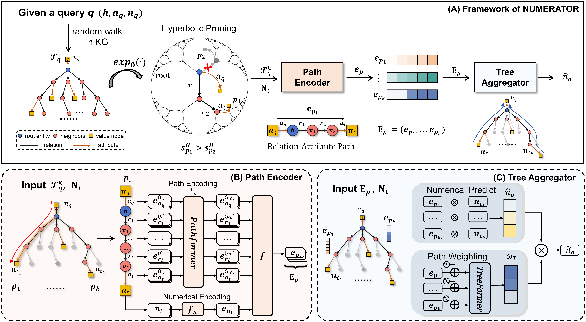

# Numerator

This repository contains the code implementation for the paper '*Numerical Reasoning on Knowledge Graphs: From a Chain Perspective*', which explores the numerical attribute prediction on Knowledge graphs.



## Project Structure
```
├── data/               # Directory for storing datasets
├── output/            # Directory for experiment results
├── README.md           # Project documentation
├── models.py           # Model implementation
├── utils.py            # Utility functions
└── main.py             # Training script
```

## Experiment Environment

- python 3.9

- pytorch 2.1+

- torch-geometric 2.4.0


## Download Datasets

Download the datasets from the following link: https://drive.google.com/drive/folders/10dmlwjv1XvPwu6Yfx-XNqpZzgyFiGC1v?usp=sharing
